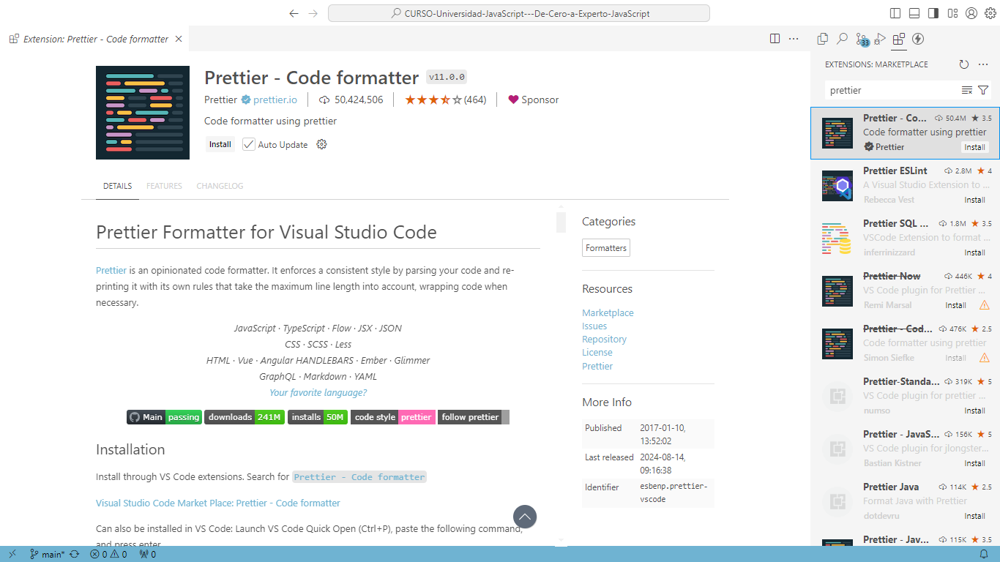
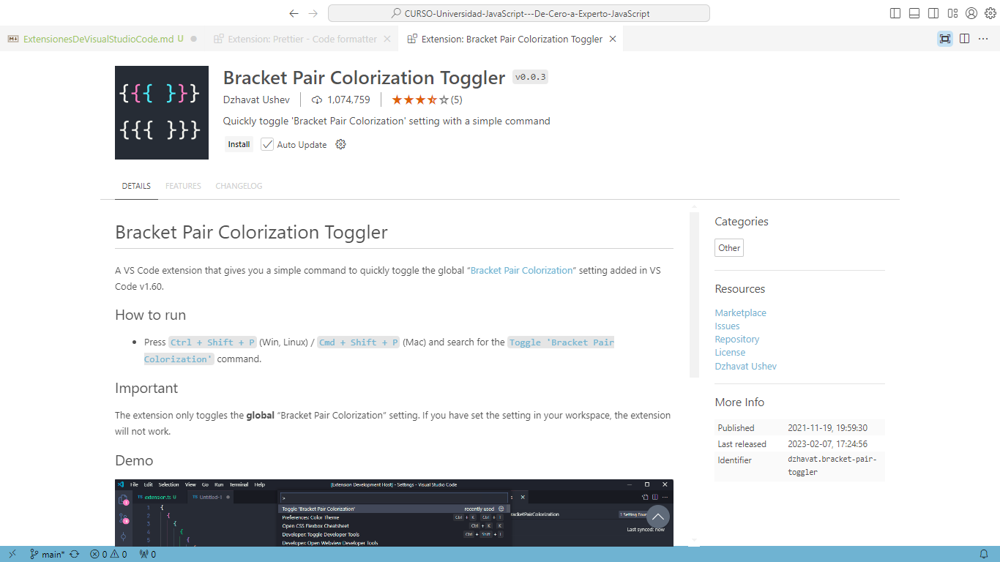
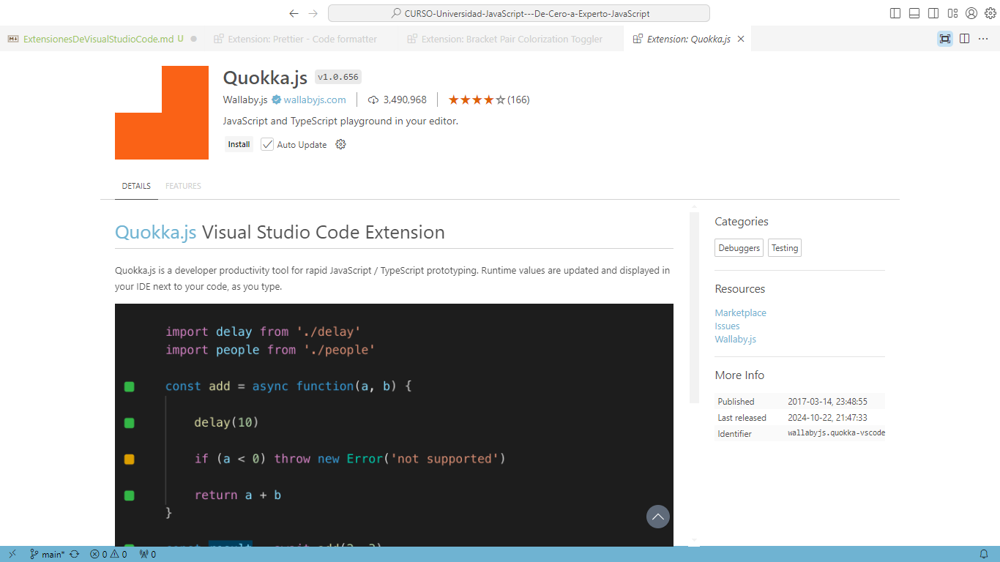
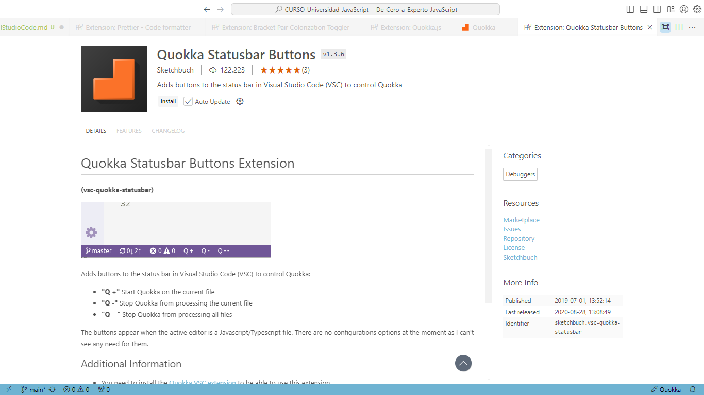

# Extensiones a utilizar durante el curso

A continuación se describen las extensiones a utilizar durante el desarrollo del curso.

## Extensiones

### Prettier - Code formatter

Esta extensión sirve para dar formato de color a palabras reservadas y sintaxis del lenguaje JavaScript

### Bracket Pair colorization Toggler

Esta extensión servirá como apoyo para marcar las llaves de cierre y apertura emparejadas y con la sintaxis correcta dentro del código de JavaScript

### Quokka.js

Permite depurar el código escrito en JavaScript desde el mismo editor de texto, donde con efectos mágicos podremos ver los valores para cada una de las variables utilizadas en el código.

### Quokka Statusbar Buttons

Añade tres botones:

- Q +
- Q -
- Q --

con los cuales podremos iniciar y detener la ejecución de Quokka

