# Instalar Visual Studio Conde [VSCode]
A continuación se muestra una forma de instalar el editor de texto *Visual Studio Code*:

## PASOS

Primero, es necesario tener un *navegador web*, como firefox, chrome o edge y abrirlo

En cualquiera de los navegadores mencionados, buscar VSCode:

Entre todas las opciones disponibles, buscar la página oficial de *Visual Studio Code*:\
[https://code.visualstudio.com](https://code.visualstudio.com)

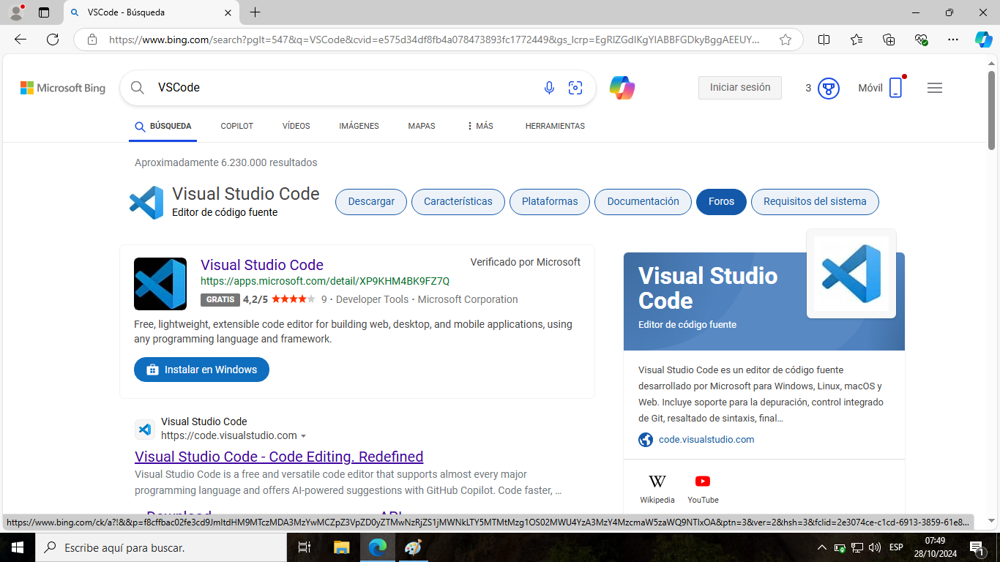

Dentro de la página oficial se nos mostrará un botón que dice: **Download for Windows**, o en caso contrario, el sistema operativo que estemos utilizando [Nota: en linux existen otras formas de instalación que no se describen aquí, pero dependerá del criterio del usuario final]:

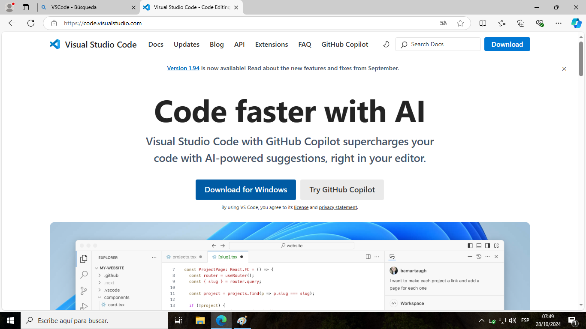

Al precionar el botón de **Download** se iniciará la descarga de *VSCode* automáticamente:

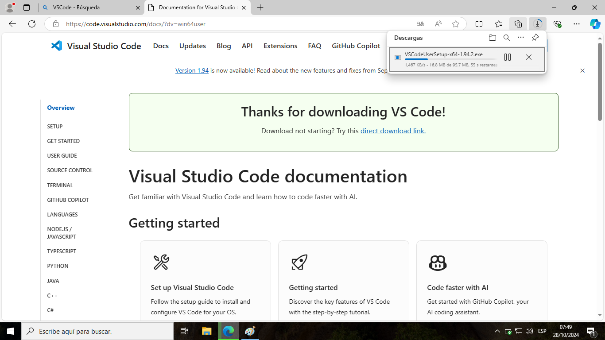

Si por alguna razón esta descarga no inicia de forma automática, podemos hacer clic en el enlace que dice **direct download link**

Terminada la descarga, comenzar con la instalación. Es preferible dirigirnos a *Administrador de Archivos* > *Descargas* >.

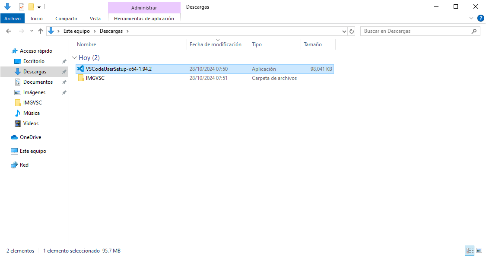

aquí dar clic derecho sobre el instalador de VSCode y elegir **Ejecutar como administrador:**

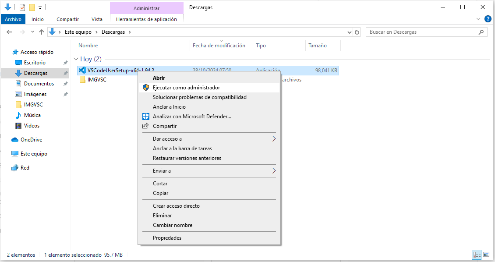

Se abrirá una ventana que menciona información acerca del tipo de versión de *VSCode* descargada, la cual hace referencia a que es la versión de usuario, la cual se instala unicamente en el usuario que lo instala, no como normalmente ocurre que existen dos maneras de instalación, tanto usuario local o para todos los usuarios.

Esta versión es la que se descarga por defecto desde la página oficial de *VSCode*, la cual tiene ventajas a la hora de necesitar actualizarse, ya que no está ligada a los ficheros del sistema, protegiendo de posibles ataques por puertas traseras o causar errores durante las acualizaciones que puedan afectar al sistema o a otras aplicaciones instaladas.

En esta ventana, simplemente le damos **Aceptar.**

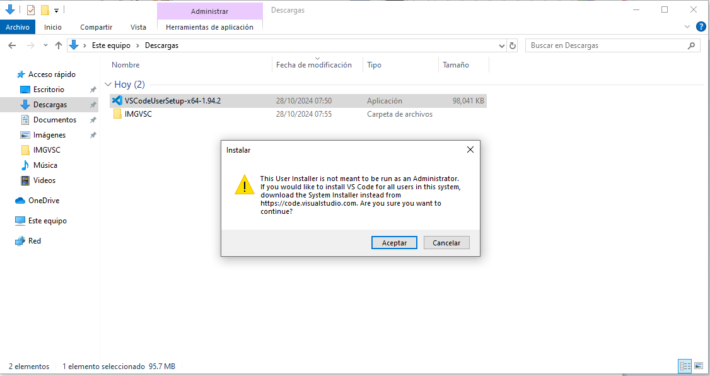

La siguiente ventana nos mostrará el acuerdo de licencia para el usuario final [EULA], el cual opcionalmente debemos leer y obligatoriamente debemos de aceptar. Luego de aceptar, damos clic en **Siguiente >.**

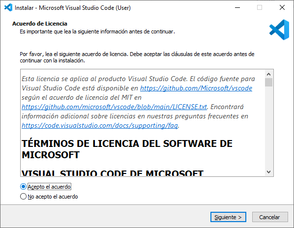

Posteriormente, nos indicará la ruta donde se instalarán los ficheros necesarios para que *VSCode* funcione. Idealmente no se modifican, pero si tu experiencia lo permite y crees que es necesario, puedes cambiarla. Luego de definir la ruta de instalación, damos clic en **Siguiente >.**

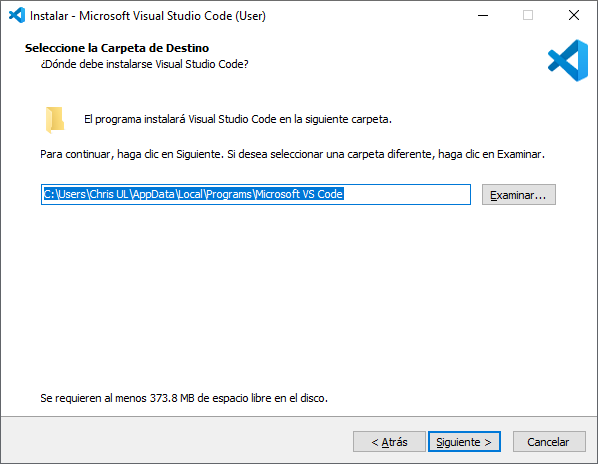

A continuación, nos pedirá el nombre de la carpeta donde se encontrará el acceso directo a *VSCode*. Luego de  definir el nombre de la carpeta, dar clic en **siguiente >.**

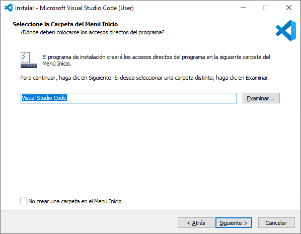

De manera gráfica, es el nombre donde podremos encontrar el icono de inicio de *VSCode* desde *Inicio de Windows*

.png)

La siguiente ventana nos mostrará algunas opciones extra que nos pueden ayudar en el uso de *VSCode*. Aquí daré enfasís en las dos opciones luego del texto **Otros:**.

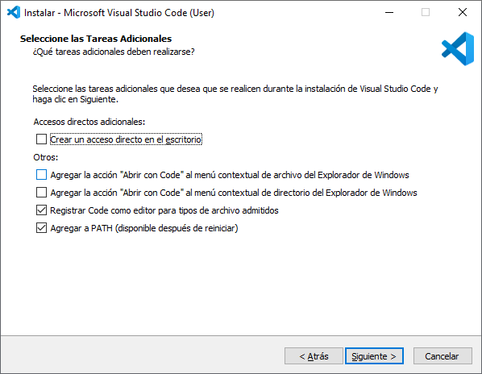

Estas opciones:

 - Agregar la acción "Abrir con Code" al menú contextual de archivo del Explorador de windows, y
 - Agregar la acción "Abrir con Code" al menú contextual de directorio del Explorador de Windows

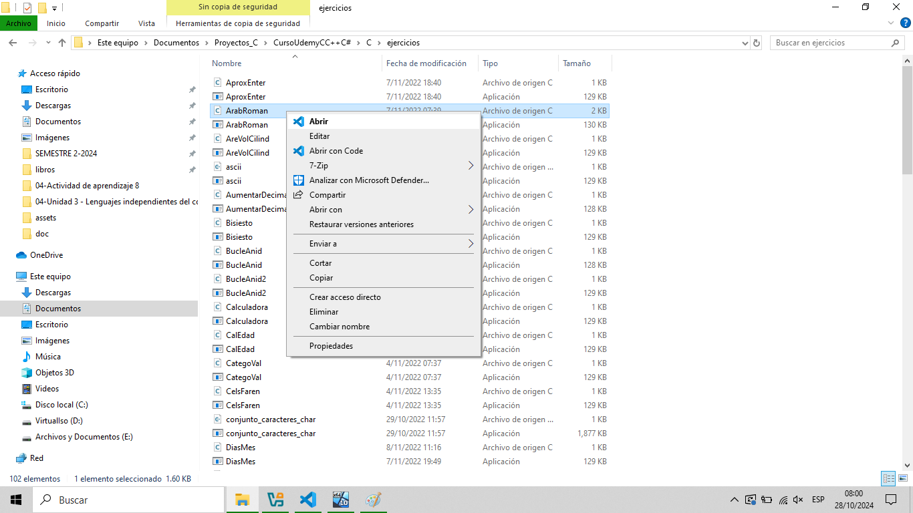

permiten añadir opciones para abrir un fichero (archivo) o una carpeta (directorio) que tengamos en vista desde el Administrador de Archivos de Windows y poder visualizarlo desde VSCode, brindandonos una mayor agilidad al utilizar este editor.

Dado estas mejoras en la accesibilidad de ficheros y directorios, añadimos (opcionalmente) las dos opciones mencionadas. Luego damos clic en **siguiente >.**

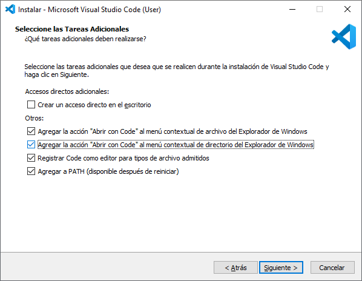

Casi por finalizar, nos indicará un resumen de las actividades que el instalador de *Visual Studio Code* realizará, las mismas acciones que fuimos indicando previamente. Si todo está correcto, dar clic en **Instalar.**

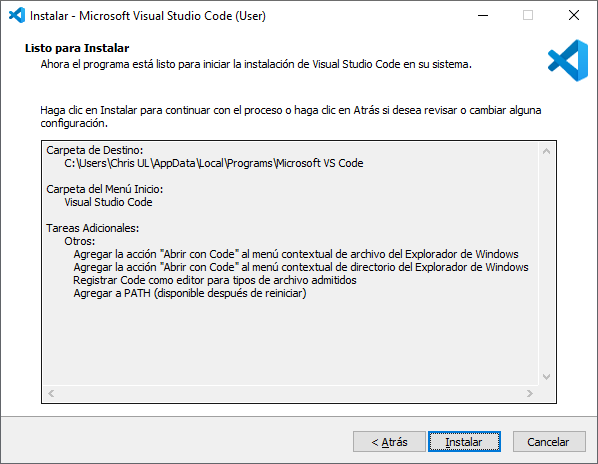

Se procederá a la instalación de *VSCode*...

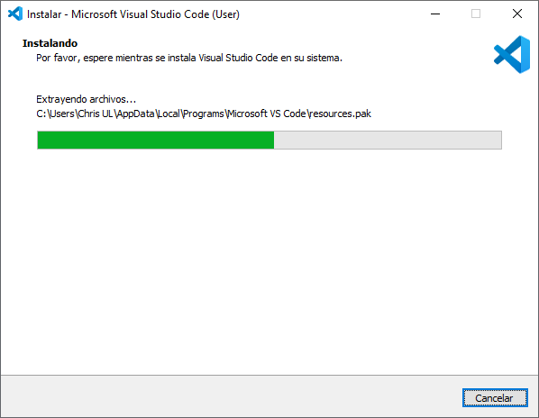

al terminar, se marcará la casilla de *Ejecutar Visual Studio Code*, dar clic en *Finalizar:*

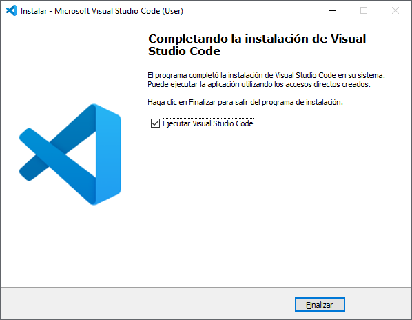

La primera vista de *VSCode* nos mostrará un pequeño Tour de las caracteristicas que hacen sobresalir a este editor de los demás. Podemos ir viendo cada opción, una a una, o...

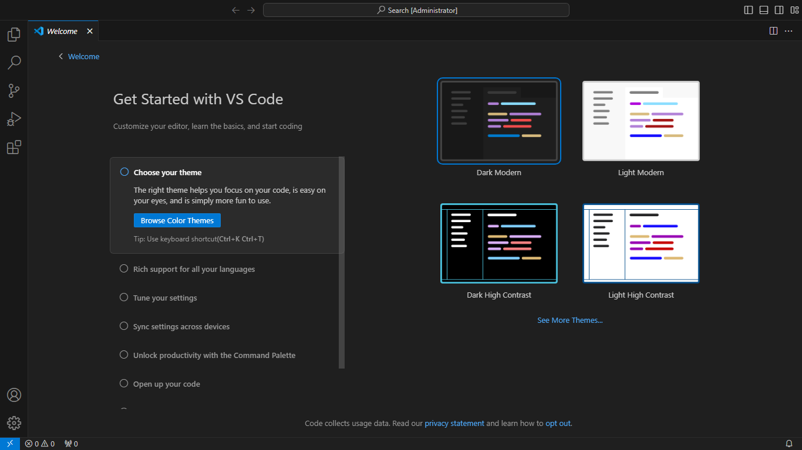

... podemos dar clic en la opción ✔✔Mark Done, hasta abajo del Tour.

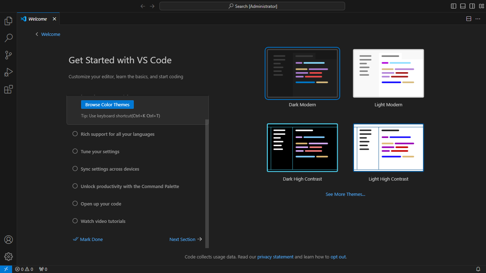

Esto nos dejará otra ventana, la cual tiene en su costado izquierdo, las opciones, de arriba hacia abajo:

📰 Explorer - Permite ver los fichero dentro de un directorio cargado.\
🔍 Search - Permite buscar una cadena de texto dentro de algún fichero del directorio cargado. De ser encontrada dicha cadena, mostrará links para dirigirnos a la parte donde se encuentran dentro del fichero.\
〽💹 Source Control - Apartado especial para el manejo de versiones con Git, en esta parte nos mostrarán los cambios en ramas (branch's) commit's realizados y opciones para clonar, pull's y commit's del repositorio remoto y local que estemos trabajando.\
🛠 Run and Debug - Apartado utilizado para correr y depurar los diversos códigos fuente que tengamos. En algunos lenguajes es posible añadir depuradores específicos para cada uno de los lenguajes.\
🧰 Extensions - Permite buscar e instalar diversas extensiones, las cuales potencian la capacidad estándar que ya posee *VSCode* al instalarse. Entre las más populares están, extensiones para el resaltado de código y palabras reservadas, inteligencia artificial, temas diversos, entre otros.

A continuación, se deja una captura de cada apartado, donde aún no se ha abierto ningún directorio o fichero:

Desde Explorer podremos abrir un directorio para trabajar los diversos códigos a construir.

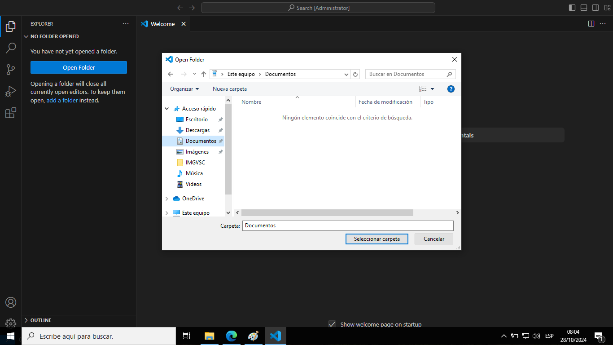

Desde Search podremos buscar palabras dentro de los ficheros, también tiene la opción de reemplazar todos los *match* con la palabra buscada por otra palabra o palabras.

Al abrir un fichero que este linkeado a un repositorio remoto de GitHub o similares, o que se trabaje de manera local con Git, en Source Control se indicaran los cambios y confirmaciones realizadas en el historial de cambios del repositorio en sí.

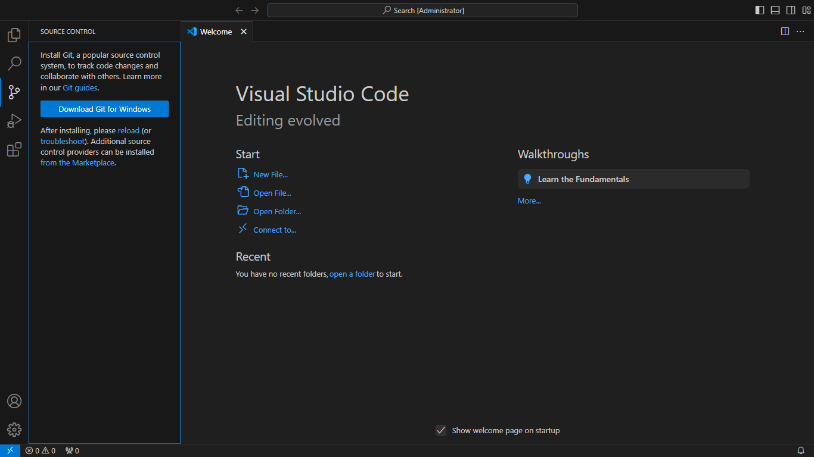

Dependiendo del lenguaje utilizado en la escritura de código, el editor de texto nos recomendará (solo para algunos lenguajes), descargar los depuradores necesarios para lograr hacer un Debug del código que estemos trabajando.

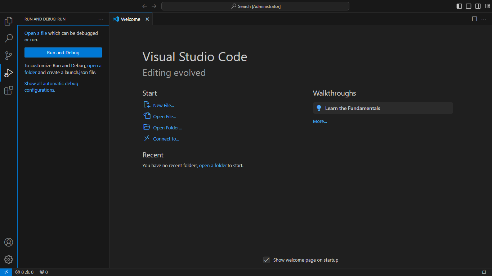

El apartado de Extensions, permitirá descargar los depuradores y demás herramientas necesarias que nos ayudarán a mejorar nuestro trabajo de programación.

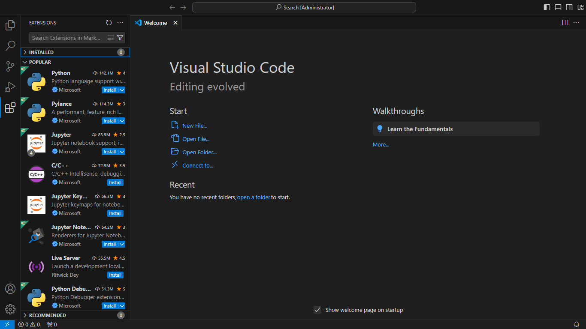

Por ejemplo, aquí buscamos una extensión para cambiar los íconos por defecto del editor.

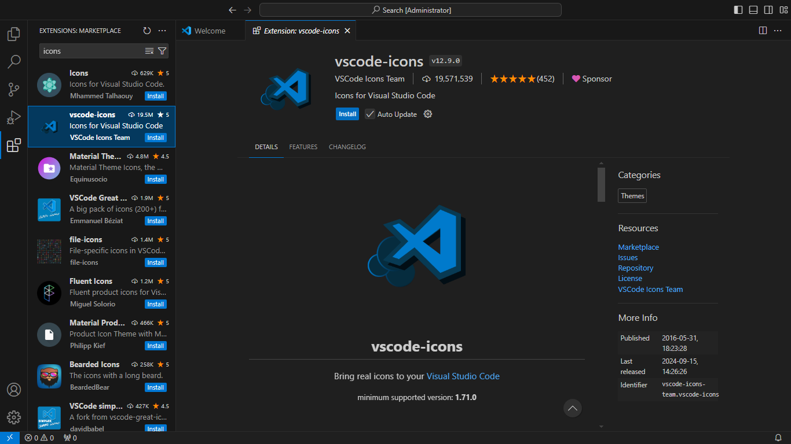

Para instalar, simplemente damos clic en el botón **Install**, el texto cambiará a **Installing**, y al terminar nos indicara que ya extensión se instaló de manera correcta. En este caso y en algunas otras extensiones, también indicará desde la barra superior central, si deseamos confirmar algún cambio que afectará a la interfaz gráfica del editor. Aquí nos pregunta que kit de íconos utilizar, por lo cual seleccionamos el nuevo kit de íconos *VSCode icons*.

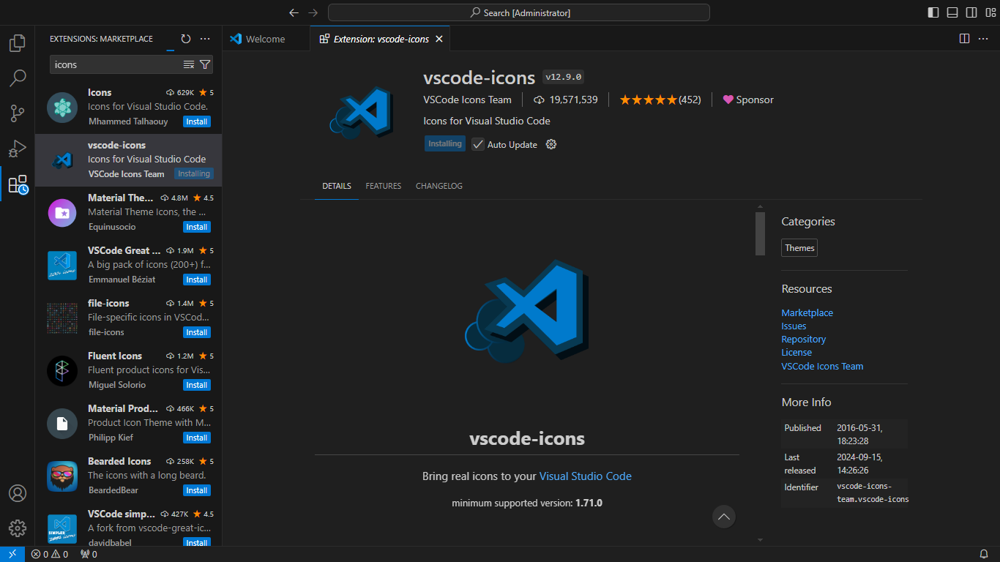

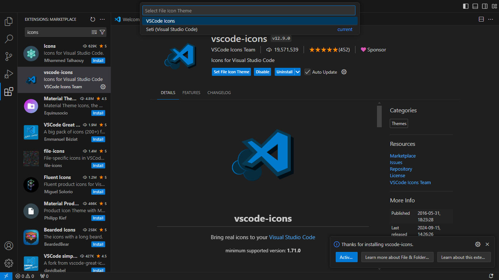