# Instalación de NodeJS

A continuación se describirá como descargar e instalar *NodeJS* en *Windows 10 Home Edition*

## Descargar NodeJS

Como primer paso, desde nuestro navegador web favorito, buscar node js

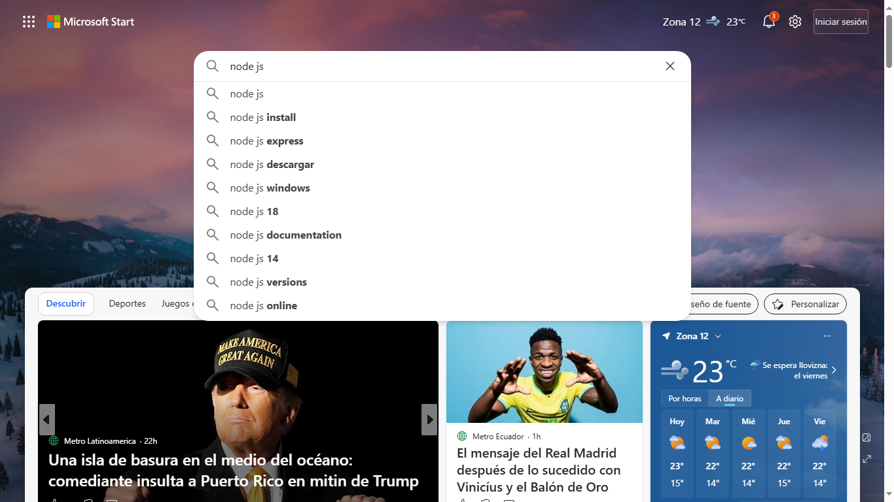

Entre las diversas opciones que nos brinda el buscador, seleccionamos la página oficial de *NodeJS*:

[https://nodejs.org](https://nodejs.org)

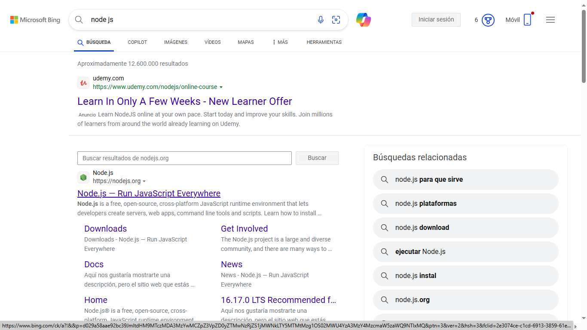

Dentro de la página oficial de *NodeJS*, presionamos en el botón que dice:
**Download Node js(LTS)**, **LTS** significa que es una versión con soporte a largo plazo (*Long Term Support*).

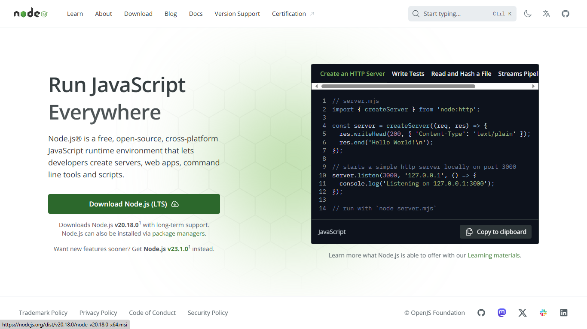

Esto provocará que se descargue la última versión de *NodeJS* en nuestro equipo

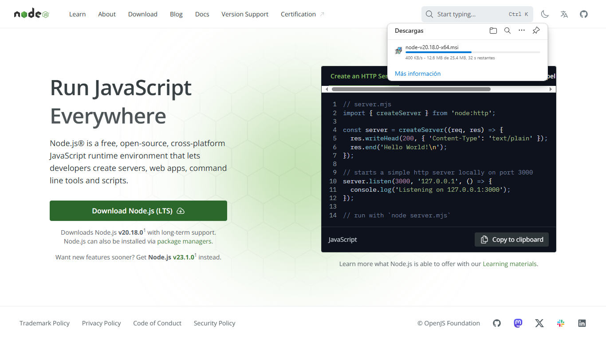

Habiéndose descargado en nuestro equipo el instalador, ir a *Administrador de archivos* > *Descargar*

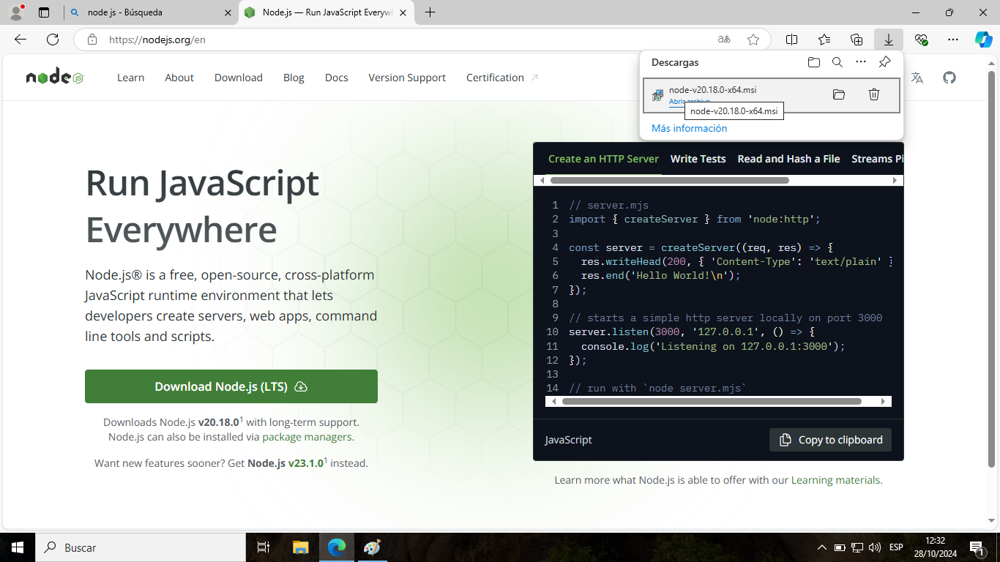

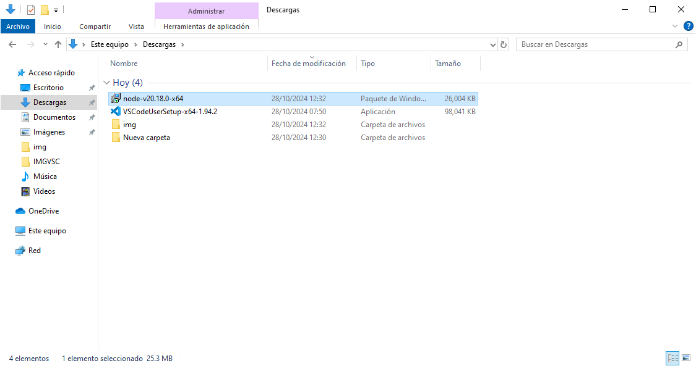

## Instalación de NodeJS

Desde aquí en descargas, dar doble clic sobre el instalador, esto provocará que el instalador se inicie en nuestro equipo

Nos indicará que *NodeJS* se instalará en nuestro equipo, dar clic en **Next.**

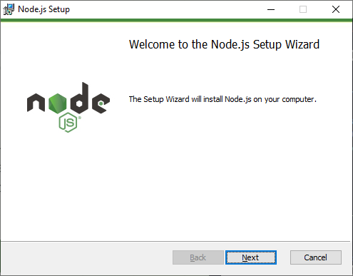

En principio, nos mostrará el acuerdo de licencia del usuario final (EULA) para el uso de *NodeJS*, el cual opcionalmente podemos leer y obligatoriamente debemos aceptar. Damos clic en el marcador que dice:

**I accept the terms in the license Agreement**

y luego dar clic en **Next**

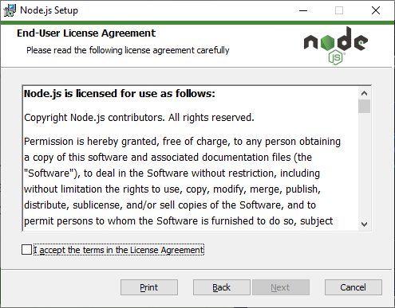

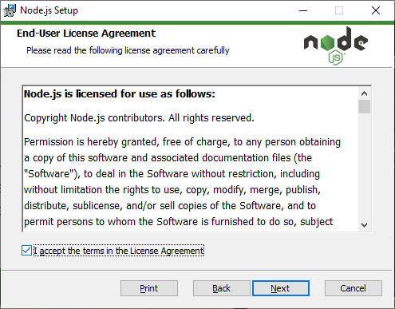

Luego preguntará la carpeta donde se desea guardar los ficheros de instalación y uso de *NodeJS*. Por defecto ofrece una ruta indicada en la partición que contiene el Sistema Operativo, pero si tu experiencia lo permite y así lo deseas, puedes seleccionar otra ruta para estos ficheros.

Seleccionada la ruta, dar clic en **Next**

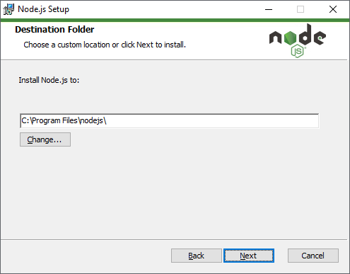

Nos mostrará las acciones de preparación en la instalación de *NodeJS* que el instalador tiene definidas por defecto. Si así lo deseas, puedes modificar esto.

Luego de aceptar cada acción, dar clic en **Next**.

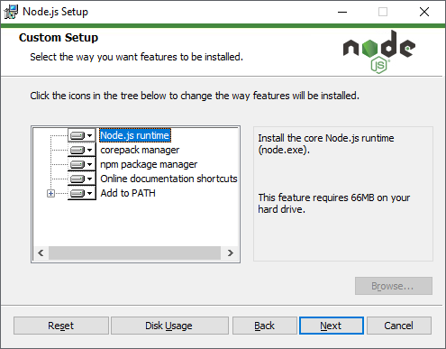

Por terminar, pregunta si desea instalar *Chocolatey*. Esto dependerá de los usos que se le darán a *NodeJS*, así que depende del usuario final.

Si el motivo es para aprender *JavaScript* y *NodeJS*, dejar desmarcado, de lo contrario, analizar si tu profesión lo necesita para añadir esta instalación en el proceso.

Dar clic en **Next**.

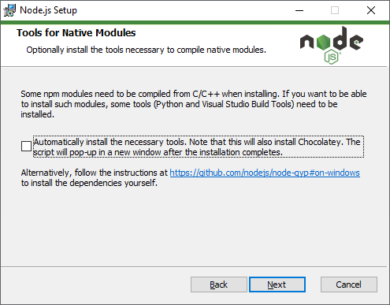

Preguntará si estamos preparados para realizar la instalación. Si es correcto, presionar **Install**. Para cancelar dar en **Cancel**

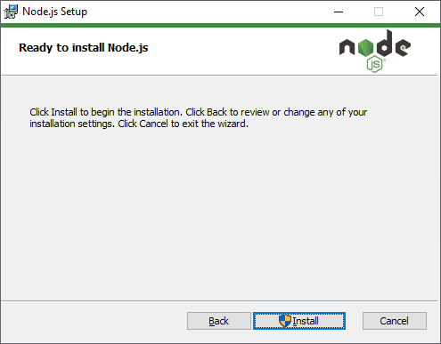

Si escojemos iniciar la instalación, mostrará una barra de *Status*

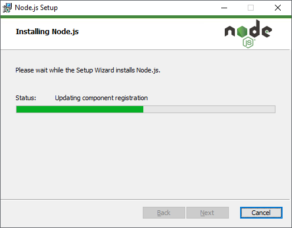

Al terminar el proceso, mostrará la última ventana, la cual indica que la instalación ha sido completada. dar clic en **Finish**

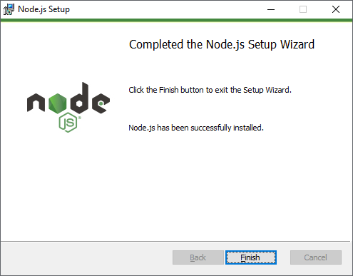

Para comprobar la instalación, ejecutar una consola de *PowerShell* y ejecutar el comando:

``` PowerShell
node --version
```

Esto nos mostrará la versión de *NodeJS* que fue instalada:

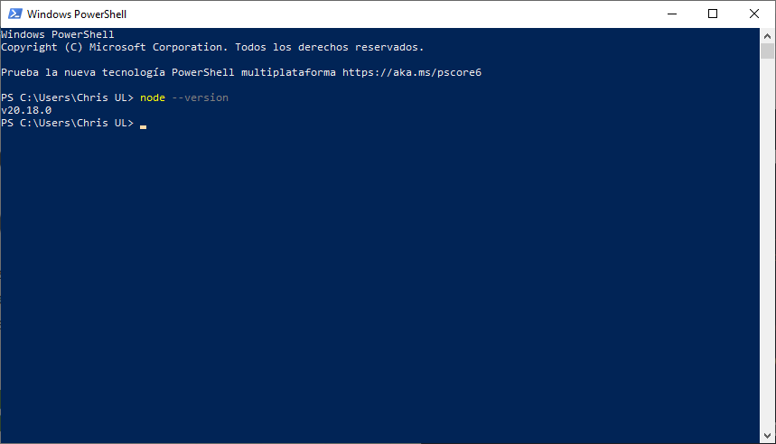